## Publications

***Physical and algal characteristics of Liberty Park Reservoir in Clarksville, Tennessee***

Lebkuecher, J., Culley, A., Georgic, B., Hohman, E., Latta, H., Salman, N., Sennuga, T., Spruill, D., ***Zorney, A.***, & Atma, J. *Phytoneuron* (2022).

This study evaluated the physical, chemical, and biological characteristics of Liberty Park Reservoir to assess ecological condition and establish baseline data for long-term monitoring. Water column analyses included light extinction, turbidity, nutrients, chlorophyll *a*, dissolved oxygen, and biochemical oxygen demand, while benthic assessments quantified periphyton biomass, sediment organic content, and algal community composition. Results indicated that the reservoir is ecologically impaired by nutrient enrichment and erosion, leading to eutrophic conditions and degraded phytoplankton and periphyton communities.

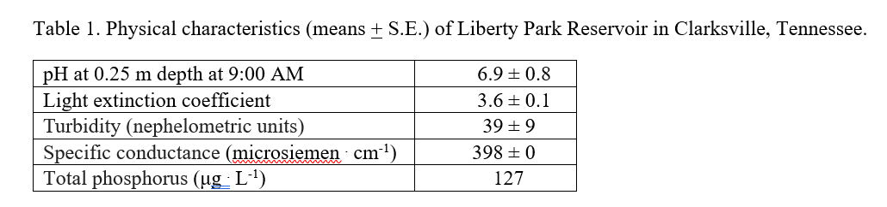{fig-alt="Table of physical characteristics"}

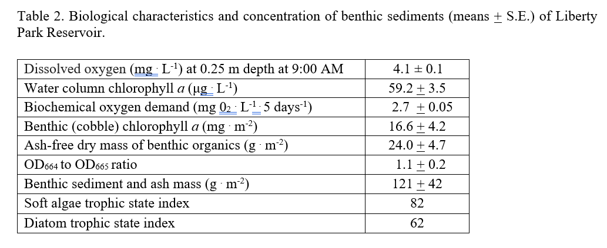{fig-alt="Table of biological characteristics"}

**Skills demonstrated:** freshwater ecosystem assessment · water quality monitoring · nutrient and chlorophyll analysis · benthic periphyton sampling · algal and diatom identification · trophic state assessment · field instrumentation · ecological data interpretation · peer-reviewed scientific writing

------------------------------------------------------------------------

## Invited Talks

### Workshop Speaker

**Gaining Experience as an Undergraduate, Washtenaw Community College — Ann Arbor, MI** *December 2025*

-   Designed and delivered a workshop for undergraduate students focused on gaining research, fieldwork, and professional experience in biology and environmental science.
-   Shared strategies for identifying opportunities, building faculty relationships, and preparing for graduate study and environmental careers.

**Skills demonstrated:** mentoring · science communication · workshop facilitation · academic advising

## Academic & Applied Projects

### Cradle-to-Gate Life Cycle Assessment of PLA vs. Nylon Fishing Line

*Life Cycle Assessment for Sustainability — Professional Science Master’s Program*

-   Conducted a cradle-to-gate life cycle assessment comparing polylactic acid (PLA) and nylon fishing line.
-   Evaluated environmental impacts across raw material extraction, manufacturing, and processing stages.
-   Applied ISO-compliant LCA methodology to assess trade-offs related to material choice and sustainability.
-   Interpreted results to inform environmentally responsible decision-making in recreational fishing gear.

**Skills demonstrated:** life cycle assessment · ISO standards · environmental impact analysis

Using openLCA I was able to conduct a Life Cycle Impact Analysis and generate Sankey diagrams demonstrating to what degree different processes contributed to a given environmental impact.

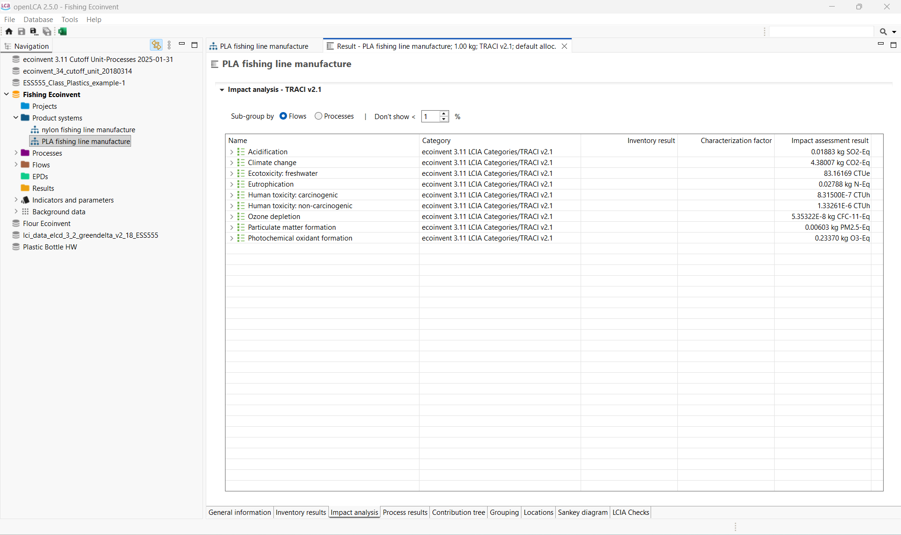{fig-alt="Screenshot of openLCA showing environmental impact analysis"}

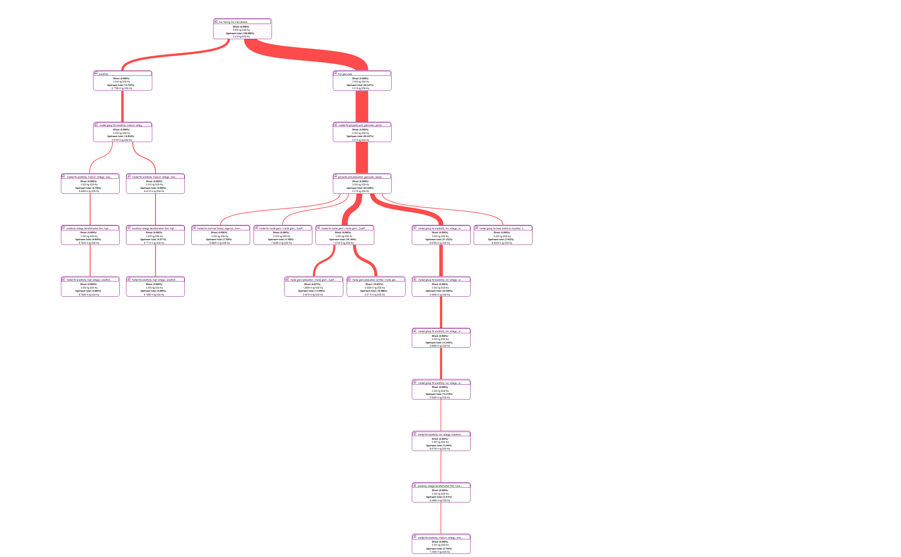{fig-alt="Sankey diagram"}

Using Excel, I was able to create figures demonstrating which material had a greater environmental impact in various categories.

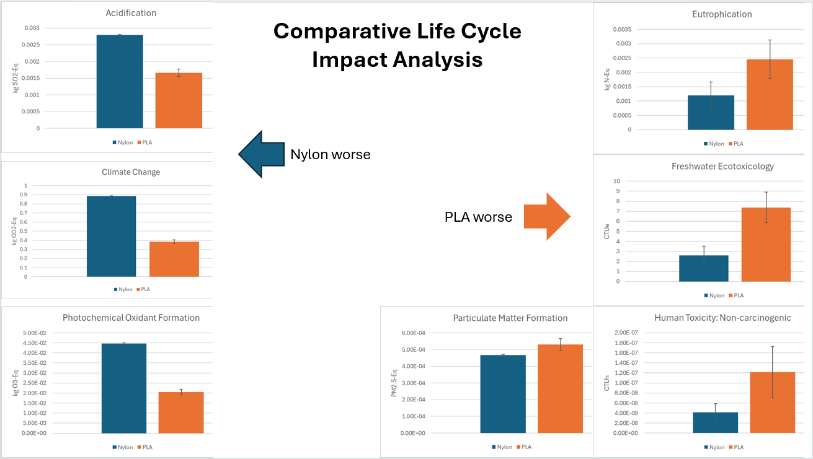{fig-alt="Graphs comparing nylon and PLA environmental impacts"}

------------------------------------------------------------------------

### Professional Website Development with Quarto

*Environmental Data Science Applications — Professional Science Master’s Program*

-   Designed and developed a personal professional website using **Quarto** to showcase academic background, research experience, and applied projects.
-   Implemented a reproducible workflow integrating **R**, **Markdown**, **Git**, and **GitHub** for version control and deployment.
-   Structured multi-page content using YAML configuration, modular `.qmd` files, and consistent site navigation.
-   Published and maintained the website using **GitHub Pages**, demonstrating deployment and web-hosting skills.
-   Emphasized clear organization, accessibility, and effective communication of technical content to diverse audiences.

**Skills demonstrated:** R · Quarto · Git · GitHub · Markdown · reproducible workflows

------------------------------------------------------------------------

## Research Project Experience (Selected)

### Orangethroat Darter (*Etheostoma spectabile*) Species Assessment

-   Assisted the Michigan Department of Natural Resources with field sampling and data analysis.
-   Contributed to a species assessment to update the conservation status of Orangethroat Darters in Southeast Michigan.

**Skills demonstrated:** freshwater fish identification · field sampling techniques · ecological data collection · collaboration with agency scientists · conservation assessment support

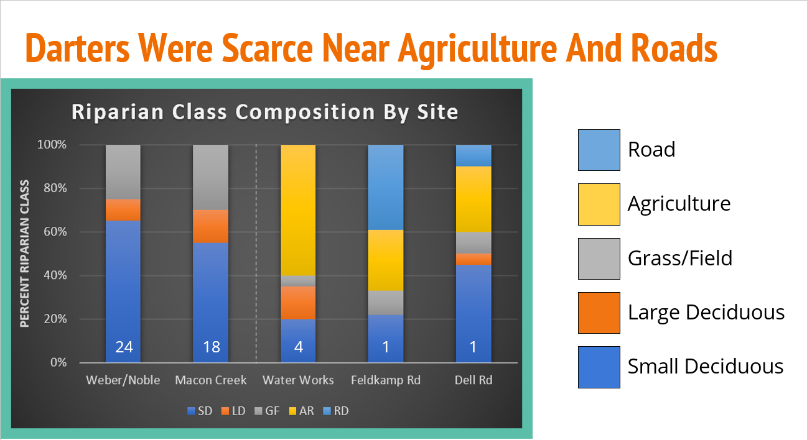{fig-alt="Graph showing darter abundance and riparian composition"}

### Trends in National Park Attendance

-   Created a function to access publicly available data related to national park attendance

-   Manipulated data for easier analysis

-   Created a visual showing the change in park attendance for ten selected parks

**Demonstrated Skills:** data retreival · data manipulation · function creation in R · data visualization

Section of code creating function to pull data from any selected park.

```{r, eval=FALSE}
unit_visitation <- function(start_month = 1, end_month = 12, start_year, end_year, park){
  raw_data_ex_3 <- httr::GET(url = paste0("https://irmaservices.nps.gov/v3/rest/stats/visitation?unitCodes=", 
park, "&startMonth=", start_month, "&startYear=", start_year, "&endMonth=", end_month, "&endYear=", end_year))
  extracted_data <- httr::content(raw_data_ex_3, as = "text", encoding = "UTF-8")
  final_data <- jsonlite::fromJSON(extracted_data)

return(final_data)
}
```

Section of code creating visual representation of attendance over time of ten selected parks.

```{r, eval=FALSE}
bonus_parks <- c("ACAD", "APPA", "BADL", "BIBE", "BICY", "CHCH", "DENA", "EVER", "GLAC", "GLBA")

bonus_units_vis <- function(start_month = 1, end_month = 12, start_year, end_year, park){
  raw_data_ex_3 <- httr::GET(url = paste0("https://irmaservices.nps.gov/v3/rest/stats/visitation?unitCodes=", 
park, "&startMonth=", start_month, "&startYear=", start_year, "&endMonth=", end_month, "&endYear=", end_year))
  extracted_bonus_data <- httr::content(raw_data_ex_3, as = "text", encoding = "UTF-8")
  final_bonus_data <- jsonlite::fromJSON(extracted_data)

return(final_bonus_data)
}

bonus_parks_map <- bonus_parks %>%
  map(~ unit_visitation(start_year = 1990, end_year = 2024, park = .x)) %>%
  bind_rows()

bonus_parks_annual <- bonus_parks_map %>%
  group_by(UnitCode, Year) %>%
  summarise(RecVisitation = sum(RecreationVisitors, na.rm = TRUE), .groups = "drop")

growth_data <- bonus_parks_annual %>%
  group_by(UnitCode) %>%
  arrange(UnitCode, Year) %>%
  mutate(
    growth_rate = (RecVisitation - lag(RecVisitation)) / lag(RecVisitation) * 100
  ) %>%
  ungroup()

bonus_growth_chart <- growth_data %>%
  filter(!is.na(growth_rate)) %>%
  ggplot(aes(x = Year, y = growth_rate, color = UnitCode)) +
  geom_line()
plotly::ggplotly(bonus_growth_chart)

growth_data_filtered <- growth_data %>%
  filter(Year >= 1990, Year <= 2018)

filtered_bonus_chart <- growth_data_filtered %>%
  filter(!is.na(growth_rate)) %>%
  ggplot(aes(x = Year, y = growth_rate, color = UnitCode)) +
  geom_line()
plotly::ggplotly(filtered_bonus_chart)
```

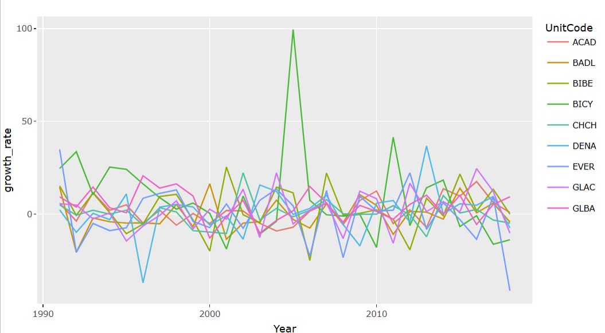{fig-alt="Graph showing changes in attendance of ten national parks"}

### Salamander Genomics in Protected Areas of Ann Arbor, Michigan

-   Participated in efforts to identify unisexual *Ambystoma* biotypes across preserved lands.
-   Supported genomic analysis and field sampling activities in protected natural areas.

**Skills demonstrated:** amphibian identification · field sampling · basic genomics workflows · laboratory techniques · data organization · research collaboration

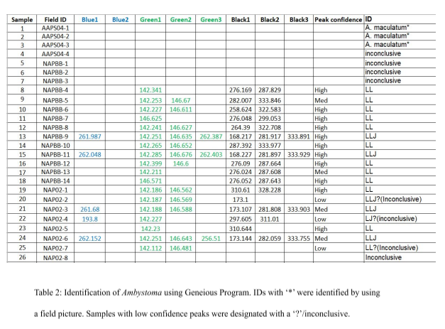{fig-alt="table results of genomic analysis"}

### Impact of Atrazine on Zebrafish Embryos

-   Conducted research on the impact of differing concentrations of atrazine on developing zebrafish embryos.

-   Utilized confocal microscopy and data analysis to identify patterns in developing zebrafish embryos exposed to various concentrations of atrazine.

**Skills demonstrated:** experimental design · confocal microscopy · data analysis · scientific writing

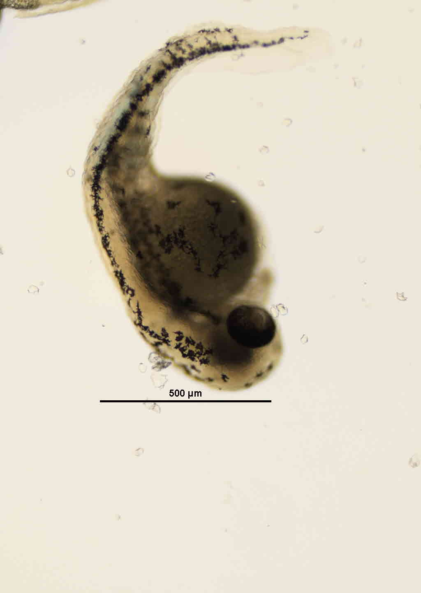{fig-alt="zebrafish under microscope" width="356"}

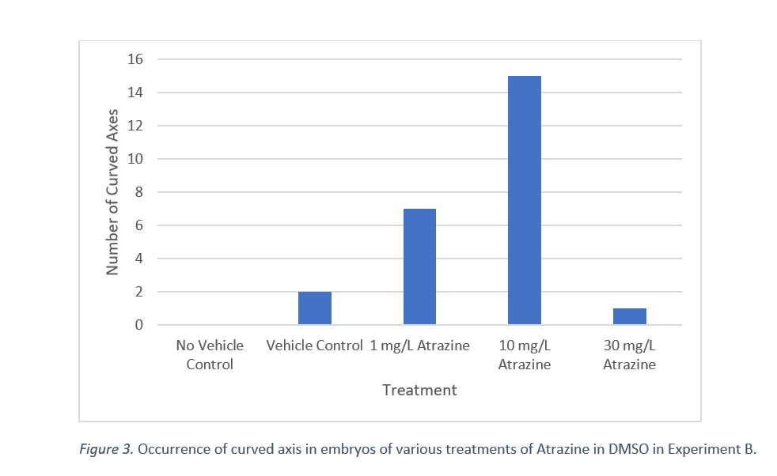{fig-alt="bar graph showing how atrazine impacts zebrafish embryos"}

### Northern Cardinal Ethogram

-   Developed a table of behaviors observed by Northern Cardinals.

-   Used observations to develop and test a hypothesis related to temporal changes in vocalization.

-   Collected and analyzed data to identify a pattern of decreasing vocalizations during midday hours.

Skills demonstrated: experimental design · data collection · data analysis · scientific writing

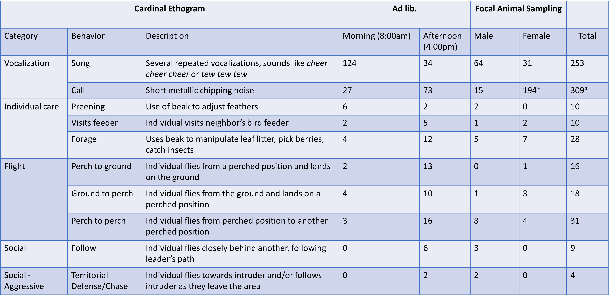{fig-alt="table showing occurrence of cardinal behaviors"}

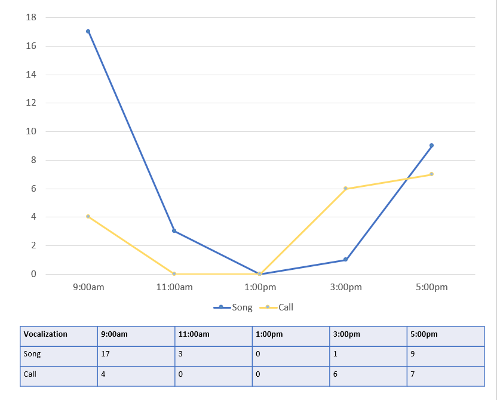{fig-alt="graph showing change in number of vocalizations over time"}

### Effects of Temperature on Snake Thermoregulation via Cover Boards

-   Conducted pilot research examining behavioral thermoregulation of local snake species.
-   Designed and implemented a cover board survey and developed a research proposal outlining methods and hypotheses.

**Skills demonstrated:** herpetological field methods · behavioral observation · experimental design · pilot study development · scientific writing · research proposal development

------------------------------------------------------------------------
